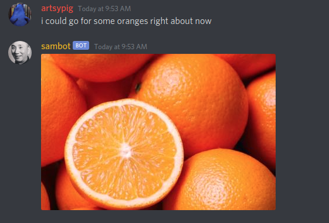

# sambot 
A discord bot which is used--at a high level--to drive user engagement in a 
discord channel. Sambot offers a variety of commands to play around with as a
server moderator (`manage_message` permissions).

## Features

#### Triggered responses
sambot parses user input searching for specific words, and responds using a 
preset response. For example, if a user message contains the word "hello",
sambot can be configured to respond with "Hello yourself!". The trigger words 
and their corresponding responses are all manageable by users of a Discord guild
with `manage_messages` permissions.

Example:

#### Triggered images
Similarly to triggered responses, sambot examines user input searching for
specific "trigger" words, and responds with an image, whose URL is specified by
the creator of the trigger. Triggered images are manageable by users of a 
Discord guild with `manage_messages` permissions.

Example:

## Future work
If you're interested in seeing what work is in the pipeline for `sambot`,
take a look at the [Trello board](https://trello.com/b/6o5lvHfk/sambot).

## Commands
Sambot's default command prefix is `$`, thus, all commands begin with the `$`
symbol. Here is a list of the commands available, and what they do.

| Command     | Parameters            | Description                                                                                                                                                                                                                                                                                                                                                                                                                                                                                                                                                                                                                                                                                                                    |
|-------------|-----------------------|--------------------------------------------------------------------------------------------------------------------------------------------------------------------------------------------------------------------------------------------------------------------------------------------------------------------------------------------------------------------------------------------------------------------------------------------------------------------------------------------------------------------------------------------------------------------------------------------------------------------------------------------------------------------------------------------------------------------------------|
| `banword`   | `word`                | Bans the word `word` from the guild. If a user types `word`, with any combination of punctuation or capitalization involved,  the message is removed from the chat, and sambot sends a DM to the sender, which says "Don't be saying that stuff.". This command should be treated as a basic language filter.                                                                                                                                                                                                                                                                                                                                                                                                                  |
| `unbanword` | `word`                | Unbans the word `word` from the guild. Basically undoes the `banword`  command, and allows users to once again use the word `word`.                                                                                                                                                                                                                                                                                                                                                                                                                                                                                                                                                                                            |
| `addpasta`  | `trigger`, `response` | Adds a user-triggerable copy-pasta to the guild. When any user types the trigger word `trigger` with any combination of punctuation and capitalization, sambot will send the message `response` to the channel. For example: `$addpasta hello "Hello yourself!"`. Every time a user types the word "hello",  sambot will reply with "Hello yourself!". Note that this trigger may not occur more than once per message, so if a user sends "hello hello hello", sambot will only respond once. **Also note that `response` is surrounded by double quotation marks in the command syntax. If you want to include double quotes in the actual response, use \" in place of " within the pair of outer double quotation marks.** |

## Message Processing

## Database and Models

## Migrations

## Hosting Locally