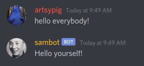

# sambot
A discord bot which is used--at a high level--to drive user engagement in a 
discord channel. Sambot offers a variety of commands to play around with as a
server moderator (`manage_message` permissions).

## 📄 Table of Contents 
* [Features](#-features)
    * [Triggered responses](#triggered-responses-)
    * [Triggered images](#triggered-images-)
    * [Language filter](#language-filter-)
* [Future Work](#-future-work)
* [Commands](#-commands)
    * [Triggered responses commands](#triggered-response-commands)
    * [Triggered images commands](#triggered-images-commands)
    * [Language filter commands](#language-filter-commands)
* [Message Processing](#-message-processing)
* [Database and Models](#-database-and-models)
* [Migrations](#-migrations)
* [Hosting Locally](#-hosting-locally)

## ✅ Features

#### Triggered Responses 🗣
sambot parses user input searching for specific words, and responds using a 
preset response. For example, if a user message contains the word "hello",
sambot can be configured to respond with "Hello yourself!". The trigger words 
and their corresponding responses are all manageable by users of a Discord guild
with `manage_messages` permissions. The triggered responses can be locked with 
cooldowns, to prevent spam. There are two types of cooldowns to choose from,
which will each be explained in detail in the 
[Commands](#triggered-response-commands) section.

Example:

#### Triggered images 📷
Similarly to triggered responses, sambot examines user input searching for
specific "trigger" words, and responds with an image, whose URL is specified by
the creator of the trigger. Triggered images are manageable by users of a 
Discord guild with `manage_messages` permissions. Triggered images also have
cooldown support similarly to triggered responses, which will be explained in
the [Commands](#triggered-images-commands) section.

Example:

#### Language filter 🤬
Again similarly to triggered responses and images, sambot is equipped with a 
rudimentary language filter. Members of a guild with `manage_message` 
permissions may ban or unban words from the guild at any point. If a word is 
banned in a guild and a user attempts to send a message that contains that word,
sambot immediately deletes the offending message, and sends the user a warning 
in a direct message. This language filter ignores punctuation found within 
words, to make it harder to circumvent. For more information on banning words,
see the [Commands](#language-filter-commands) section. 

## 📝 Future Work
If you're interested in seeing what work is in the pipeline for `sambot`,
take a look at the [Trello board](https://trello.com/b/6o5lvHfk/sambot).

## 🤖 Commands
Sambot's default command prefix is `$`, thus, all commands begin with the `$`
symbol. Here is a list of the commands available, and what they do.

#### Triggered response commands
| Command       | Parameters            | Description                                                                                                                                                                                                                                                                                                                                                                                                                                                                                                                                                                                                                                                                                                                                                                                                                                                                                                                                                                                                                              |
|---------------|-----------------------|------------------------------------------------------------------------------------------------------------------------------------------------------------------------------------------------------------------------------------------------------------------------------------------------------------------------------------------------------------------------------------------------------------------------------------------------------------------------------------------------------------------------------------------------------------------------------------------------------------------------------------------------------------------------------------------------------------------------------------------------------------------------------------------------------------------------------------------------------------------------------------------------------------------------------------------------------------------------------------------------------------------------------------------|
| `addpasta`    | `trigger`, `response` | Adds or updates a user-triggerable copy-pasta to the guild, with trigger word `trigger`. When any user types the trigger word `trigger` with any combination of punctuation  and capitalization, anywhere in a message, sambot will send the message `response`  to the channel. Note that this `trigger` will not fire off more than once per message,  so if a user sends "hello hello hello", and "hello" is a registered `trigger`, sambot will only respond once. Sambot also only responds to at most one `trigger` per message, so if a user's message contains more than one registered `trigger`, sambot will respond to the one that appears first. **Note that `response` is surrounded by double  quotation marks in the command syntax. If you want to include double quotation marks in the actual response, use \\" in place of " in the `response` string.**     Example:  `$addpasta hello "Hello yourself!"`   Example with quotation marks in `response`:   `$addpasta hello "Hello my name is \"sambot\""` |
| `removepasta` | `trigger`             | Removes a user-triggerable copy-pasta from the guild. Essentially acts as an undo of the  `addpasta` command.     Example:   `$removepasta hello`                                                                                                                                                                                                                                                                                                                                                                                                                                                                                                                                                                                                                                                                                                                                                                                                                                                                                             |
| `pastadelay`  | `duration`            | Sets the `duration` (in seconds) that users must wait before re-triggering a triggered response. If a user attempts to trigger a response before `duration` seconds have passed since the last time they triggered that response, then sambot takes no action. By default this "cooldown" is applied on a per-response basis, meaning that a user triggering a response has no influence on whether or not they may trigger a different response.     Example (set the cooldown to 5 minutes):   `$pastadelay 300`
#### Triggered images commands
| Command       | Parameters       | Description                                                                                                                                                                                                                                                                                                                                                                                                                                                                                                                                                                                                                                                                                                                    |
|---------------|------------------|--------------------------------------------------------------------------------------------------------------------------------------------------------------------------------------------------------------------------------------------------------------------------------------------------------------------------------------------------------------------------------------------------------------------------------------------------------------------------------------------------------------------------------------------------------------------------------------------------------------------------------------------------------------------------------------------------------------------------------|
| `addimage`    | `trigger`, `URL` | Adds or updates a user-triggerable image to the guild, with the trigger word `trigger`. This command works the same way as `addpasta`, except that instead of a text response, sambot sends an image to the channel. The `URL` parameter is any URL to an image, surrounded by double quotation marks. Sambot will attempt to download the image specified by `URL`, and will store it on his local database for future use.     Example:   `$addimage github "https://github.githubassets.com/images/modules/logos_page/GitHub-Mark.png"`|
| `removeimage` | `trigger`        | Removes a user-triggerable image from the guild. Works the same as `removepasta` except with images. Acts as an undo of the `addimage` command.     Example:   `$removeimage github` |
| `imagedelay`  | `duration`       | Sets the `duration` (in seconds) that users must wait before re-triggering a triggered image. Works the same as `pastadelay`, but applies only to triggered images. Similarly to `pastadelay`, this cooldown acts on a per-image basis by default.     Example (set the cooldown to 1 hour):   `$imagedelay 3600`
#### Language filter commands
| Command     | Parameters            | Description                                                                                                                                                                                                                                                                                                                                                                                                                                                                                                                                                                                                                                                                                                                    |
|-------------|-----------------------|--------------------------------------------------------------------------------------------------------------------------------------------------------------------------------------------------------------------------------------------------------------------------------------------------------------------------------------------------------------------------------------------------------------------------------------------------------------------------------------------------------------------------------------------------------------------------------------------------------------------------------------------------------------------------------------------------------------------------------|
| `banword`   | `word`                | Bans the word `word` from the guild. If a user types `word`, with any combination of punctuation or capitalization involved,  the message is removed from the chat, and sambot sends a DM to the sender, which says "Don't be saying that stuff.". This command should be treated as a basic language filter.                                                                                                                                                                                                                                                                                                                                                                                                                  |
| `unbanword` | `word`                | Unbans the word `word` from the guild. Basically undoes the `banword`  command, and allows users to once again use the word `word`.                                                                                                                                                                                                                                                                                                                                                                                                                                                                                                                                                                                            |

## 💬 Message Processing

## 🗄 Database and Models 

## 📥 Migrations

## 💻 Hosting Locally